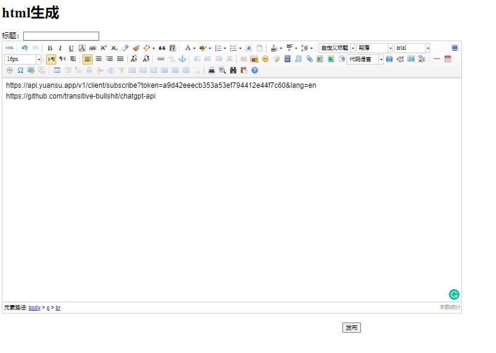
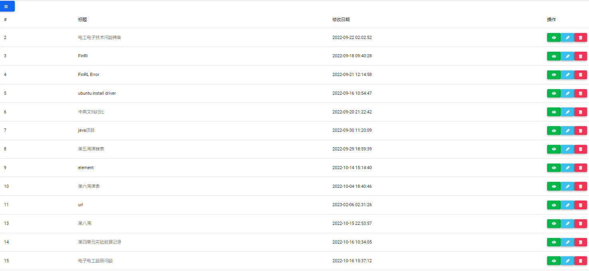
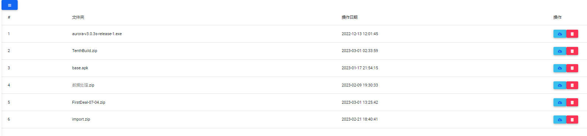

# 一、项目介绍

&emsp;&emsp;本人常游走于各系统和设备之间,数据的传输和共享一直是一个问题,在国内常用qq和WeChat传输数据,但很多设备不支持一些固定的程序员,但是如果数据在一个网络平台上,那么只要你可以连接网络便可以下载和上传数据了,于是搭建了一个小网站,用来传输数据之用。


# 二、环境搭建

&emsp;&emsp;这个小demo使用的是ubuntu服务器+php+mysql+apache实现的,mysql用来存储web文本即富文本数据,php用于后端交互,前端开发使用的是bootstrap。

&emsp;&emsp;使用这个demo,只需将w2h目录下的文件放到服务器的/var/www/html/目录下即可,不多需要在php中配置好文件上传的路径,mysql设置一个表单存储将字段设置为longtext。

服务器参数配置:
* mysql
下面这个文件是连接mysql的信息,修改为自己服务器和数据库的信息,该文件路径为w2h/php/LOGIN.txt
{"IP":"localhost","USER":"w2h","PASS":"q^QNlMP@avyD","DATABASE":"FWB"}

* 创建数据库


```
CREATE TABLE fwb(fwb_id INT AUTO_INCREMENT PRIMARY KEY, 
                    neirong LONGTEXT NOT NULL, 
                    fwb_time DATETIME NOT NULL);
```

* 上传文件地址配置

在upload_file.php和only_upload_file.php以及only_multi_upload_file.php中需要更改文件存储的地址,并且要在服务器中对文件夹进行可读写赋权。


# 三、结果展示

&emsp;&emsp;下面略贴几张图。

<div align="center">
  
</div>

<p align="center">图3.1 概略图</p>

<div align="center">
  
</div>

<p align="center">图3.2 富文本编辑器</p>

<div align="center">
  
</div>

<p align="center">图3.3 富文本列表</p>

<div align="center">
  
</div>

<p align="center">图3.4 文件存储</p>

# 四、发展方向


&emsp;&emsp;demo确实显得有些丑陋,不过也勉强能用,待有时间再升级一下,增加写功能,编写一个app或微信小程序,在移动段也能优美地访问。


# 五、总结

&emsp;&emsp;总的来说做得有点乱,没有组织好,有机会再改改吧，想玩玩的朋友有问题可联系我，email：2305892150@qq.com。

# 参考

1、菜鸟教程,[上传文件](https://www.runoob.com/php/php-file-upload.html)

